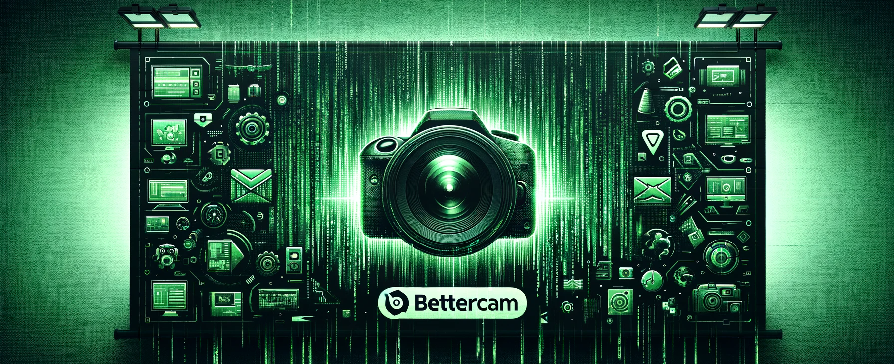

# 📸 **BetterCam** 🚀


[](http://makeapullrequest.com)
> ***🌟 World's Fastest Python Screenshot Library for Windows 🐍***

```python
import bettercam
camera = bettercam.create()
camera.grab()
```

## 🌈 Introduction
BetterCam is the World's 🌏 Fastest Publicly available Python screenshot library for Windows, boasting 240Hz+ capturing using the Desktop Duplication API 🖥️💨. Born from [DXCam](https://github.com/ra1nty/DXcam), it shines in deep learning pipelines for FPS games, outpacing other Python solutions like [python-mss](https://github.com/BoboTiG/python-mss) and [D3DShot](https://github.com/SerpentAI/D3DShot/).

BetterCam's superpowers include:
- 🚅 Insanely fast screen capturing (> 240Hz)
- 🎮 Capture from Direct3D exclusive full-screen apps without interruption, even during alt+tab.
- 🔧 Auto-adjusts to scaled / stretched resolutions.
- 🎯 Precise FPS targeting for Video output.
- 👌 Smooth NumPy, OpenCV, PyTorch integration, etc.

> ***💞 Community contributions warmly invited!***

## 🛠️ Installation
### From PyPI:
```bash
pip install bettercam
```

**Note:** 🧩 OpenCV is needed by BetterCam for color space conversion. Install it with `pip install opencv-python` if not yet available.


## 📚 Usage
Each monitor is paired with a `BetterCam` instance.
To get started:
```python
import bettercam
camera = bettercam.create()  # Primary monitor's BetterCam instance
```
### 📷 Screenshot
For a quick snap, call `.grab`:
```python
frame = camera.grab()
```
`frame` is a `numpy.ndarray` in the `(Height, Width, 3[RGB])` format by default. Note: `.grab` may return `None` if there's no update since the last `.grab`.

To display your screenshot:
```python
from PIL import Image
Image.fromarray(frame).show()
```
For a specific region, provide the `region` parameter with a tuple for the bounding box coordinates:
```python
left, top = (1920 - 640) // 2, (1080 - 640) // 2
right, bottom = left + 640, top + 640
region = (left, top, right, bottom)
frame = camera.grab(region=region)  # A 640x640x3 numpy ndarray snapshot
```

### 📹 Screen Capture
Start and stop screen capture with `.start` and `.stop`:
```python
camera.start(region=(left, top, right, bottom))  # Capture a region (optional)
camera.is_capturing  # True
# ... Your Code
camera.stop()
camera.is_capturing  # False
```

### 🔄 Retrieving Captured Data
When capturing, grab the latest frame with `.get_latest_frame`:
```python
camera.start()
for i in range(1000):
    image = camera.get_latest_frame()  # Waits for a new frame
camera.stop()
```

## ⚙️ Advanced Usage & Notes
### 🖥️ Multiple Monitors / GPUs
```python
cam1, cam2, cam3 = [bettercam.create(device_idx=d, output_idx=o) for d, o in [(0, 0), (0, 1), (1, 1)]]
img1, img2, img3 = [cam.grab() for cam in (cam1, cam2, cam3)]
```
To list devices and outputs:
```pycon
>>> import bettercam
>>> bettercam.device_info()
>>> bettercam.output_info()
```

### 🎨 Output Format
Select your color mode when creating a BetterCam instance:
```python
bettercam.create(output_idx=0, output_color="BGRA")
```
We support "RGB", "RGBA", "BGR", "BGRA", "GRAY" (for grayscale). Right now only `numpy.ndarray` shapes are supported: `(Height, Width, Channels)`.

### 🔄 Video Buffer
Frames go into a fixed-size ring buffer. Customize its max length with `max_buffer_len` on creation:
```python
camera = bettercam.create(max_buffer_len=512)
```

### 🎥 Target FPS
For precise FPS targeting, we use the high-resolution `CREATE_WAITABLE_TIMER_HIGH_RESOLUTION`:
```python
camera.start(target_fps=120)  # Ideally, not beyond 240Hz.
```

### 🔄 Video Mode
For constant framerate video recording, use `video_mode=True` during `.start`:
```python
# Example: Record a 5-second, 120Hz video
camera.start(target_fps=target_fps, video_mode=True)
# ... Video writing code goes here
```

### 🛠️ Resource Management
Call `.release` to stop captures and free resources. Manual deletion also possible:
```python
del camera
```

## 📊 Benchmarks
### Max FPS Achievement:
```python
cam = bettercam.create()
# ... Benchmarking code...
```
|         | BetterCam Nvidia GPU :checkered_flag: | BetterCam :checkered_flag: | DXCam  | python-mss | D3DShot |
|---------|---------------------------------------|--------------------------|--------|------------|---------|
| Avg FPS | 111.667                               | 123.667                  | 39     | 34.667     | N/A     |
| Std Dev | 0.889                                 | 1.778                    | 1.333  | 2.222      | N/A     |

### FPS Targeting:
```python
# ... Sample code to test target FPS ...
```
| Target/Result | BetterCam Nvidia GPU :checkered_flag: | BetterCam :checkered_flag:   | DXCam | python-mss | D3DShot |
|---------------|---------------------------------------|--------------------------|-------|------------|---------|
| 120fps        | 111.667, 0.889                        | 88.333, 2.444            | 36.667, 0.889   | N/A        | N/A     |
| 60fps         | 60, 0                                 | 60, 0                    | 35, 5.3   | N/A        | N/A     |

## 📝 Referenced Work
- [DXCam](https://github.com/ra1nty/DXcam): Our origin story.
- [D3DShot](https://github.com/SerpentAI/D3DShot/): Provided foundational ctypes.
- [OBS Studio](https://github.com/obsproject/obs-studio): A treasure trove of knowledge.

[^1]: [Preemption (computing)](https://en.wikipedia.org/wiki/Preemption_(computing))
[^2]: [Time.sleep precision improvement](https://github.com/python/cpython/issues/65501)